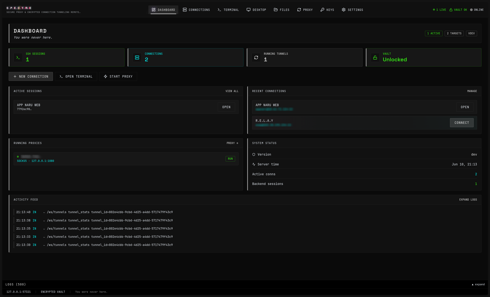
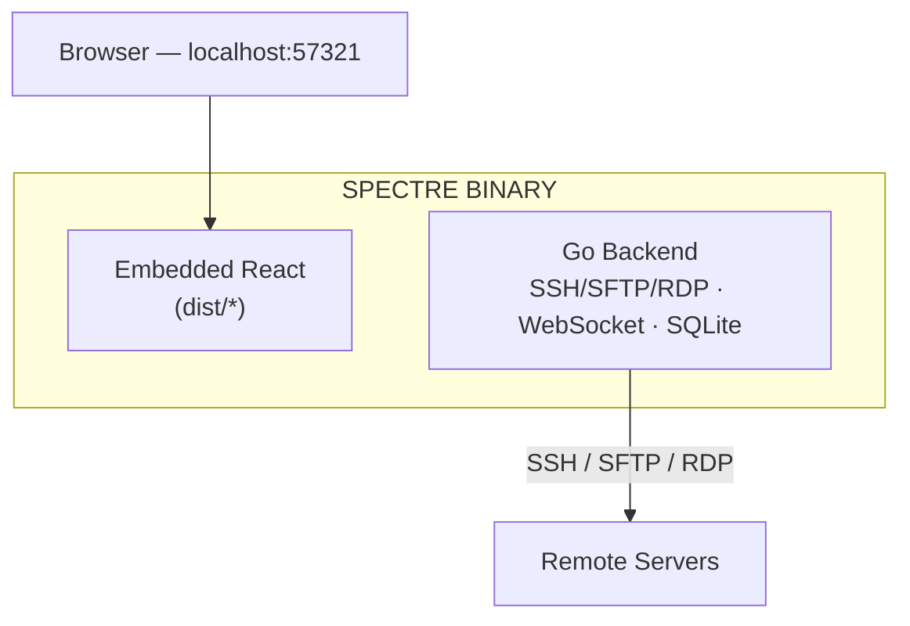

<p align="center">
  
</p>

# S.P.E.C.T.R.E

**Secure Proxy & Encrypted Connection Tunneling Remote Environment**

> *You were never here.*

SPECTRE is a local-first SSH, SFTP, and RDP manager that runs as a **single Go binary** with an embedded React web UI. Sessions persist in the backend daemon — close your browser tab and the connection stays alive.



*Active connections, sessions, and tunnels at a glance.*

## Features

### Core
- **Connection Manager** — CRUD for SSH and RDP accounts, sidebar groups/folders, encrypted credential storage; per-connection proxy or proxy-chain routing
- **Terminal** — Multi-tab xterm.js terminals over WebSocket with session persistence
- **RDP Desktop** — In-browser Windows remote desktop (`protocol: rdp`) over WebSocket; multi-tab sessions with keyboard/mouse input and resize
- **SFTP File Manager** — Browse, upload, download, mkdir, delete, rename; drag-and-drop with parallel upload queue; opens at remote home directory; clickable path breadcrumbs and folder navigation loading states
- **Encrypted Vault** — AES-256-GCM password encryption with PBKDF2 master password
- **Config Import/Export** — JSON and encrypted `.spectre` format
- **Themes** — Default SPECTRE dark purple, plus Pure Dark (neutral grays), pink, and green variants; selectable in Settings

### Power (Phase 2)
- **SOCKS5 & Port Forwarding** — Proxy manager with connection graph visualization and traceroute-style route trace
- **Proxy Chains** — Chain multiple SOCKS5 tunnels or external proxies for multi-hop routing; assign chains to connections (`/api/proxy-chains`)
- **SSH Key Manager** — Generate (Ed25519/RSA), import PEM keys, assign to connections
- **Connection Groups** — Sidebar grouping, create/edit/delete groups, assign connections
- **Known Host Verification** — Trust-on-first-use with host key store; mismatch prompts before connect
- **Live SFTP Progress** — WebSocket upload progress and queue panel; upload concurrency (1–10) configurable in Settings and synced live to the queue
- **Real-Time Events** — `/ws/tunnels` for tunnel snapshots and live stats; `/ws/system` for connection up/down, session lifecycle, RDP session events, and tunnel status
- **System Log Panel** — Captured API and process logs in the UI
- **Dashboard** — Active connections, sessions, tunnels at a glance
- **Global Vault Unlock Modal** — Unlock vault from anywhere in the app

### UI
- **Dotted Glow Background** — Ambient purple dot-field backdrop (replaces CRT scanlines)
- **Live Connection Cards** — Animated moving border on active connections; connecting overlay and connection-lost alert with dismiss
- **Empty Session Panes** — Guided empty states on Terminal, Desktop, and Files when no session or connection is selected
- **Navbar** — Dashboard · Connections · Terminal · Desktop · Files · Proxy · Keys · Settings; live connection count and vault status

### Platform
- **Background Daemon** — SSH and RDP sessions survive browser tab close (`spectre start --daemon`)
- **Linux System Tray** — KDE status-area ghost icon to start/stop daemon, open UI, desktop notifications
- **Tray Autostart** — `spectre tray --install-autostart` for login startup

## Architecture



See [spectre_architecture_diagram.html](spectre_architecture_diagram.html) for the interactive blueprint.

## Stack

| Layer | Technology |
|-------|------------|
| Backend | Go 1.22+, Chi v5, Gorilla WebSocket, `golang.org/x/crypto/ssh`, `pkg/sftp` |
| Frontend | React 18, Vite, Tailwind CSS v4, Zustand, Framer Motion, xterm.js v5 |
| Storage | SQLite + GORM (`CGO_ENABLED=1`) |
| Crypto | AES-256-GCM, PBKDF2 (100k iterations) |

## Prerequisites

- **Go 1.23+** with CGO enabled (requires a C compiler for SQLite)
- **Node.js 20+** and **pnpm 9+** (development/build only — not needed to run the binary)
- Linux: `gcc` / `base-devel`; system tray requires KDE/Plasma (status notifier area)
- macOS: Xcode Command Line Tools

## Quick Start

```bash
# Install dependencies
make install-deps

# Production build (frontend → embed → binary)
make build

# Run (opens browser by default)
./spectre start

# Or without browser
./spectre start --no-browser
```

Open **http://127.0.0.1:57321** — the binary serves the embedded production UI from this port.

> **Important:** After changing frontend code, run `make build` (or at minimum `make embed`) before `./spectre start` or `go run ./cmd/spectre/ start`. The Go binary embeds `internal/server/dist/` at compile time; skipping the embed step leaves stale or missing asset hashes.

## Development

Use the Vite dev server for frontend work — do **not** open `:57321` directly during development unless you have just run a production build.

| Mode | URL | UI source |
|------|-----|-----------|
| **Development** | http://localhost:5173 | Vite dev server (hot reload) |
| **Production** | http://127.0.0.1:57321 | Embedded `web/dist` in the Go binary |

### Frontend (Vite dev server on :5173)

```bash
cd web && pnpm install && pnpm dev
```

Vite proxies `/api` and `/ws` to the backend at `127.0.0.1:57321`.

### Backend (with hot reload via air)

```bash
# Install air (optional)
go install github.com/air-verse/air@latest

# Start backend
go run ./cmd/spectre/ start --no-browser
# or: make dev-backend
```

If you use `go run` and need the embedded UI on `:57321`, run `make embed` first so `internal/server/dist/` matches `web/dist/`.

### Full dev workflow

1. Terminal 1: `make dev-backend`
2. Terminal 2: `make dev-frontend`
3. Open http://localhost:5173

## CLI Usage

```bash
spectre                          # Start server (default)
spectre start                    # Start server explicitly
spectre start --daemon           # Background daemon
spectre start --port 8080        # Custom port
spectre start --bind 0.0.0.0     # Bind all interfaces (use with caution)
spectre start --no-browser       # Don't auto-open browser
spectre start --config ~/.spectre  # Custom config directory
spectre stop                     # Stop daemon
spectre status                   # Check daemon status
spectre open                     # Open browser to UI
spectre tray                     # Run system tray icon (Linux/KDE)
spectre tray --install-autostart # Autostart tray icon at login
spectre tray --uninstall-autostart  # Remove tray autostart entry
spectre service install          # systemd (Linux) / launchd (macOS) user service
spectre service uninstall        # Remove OS service
spectre service status           # Service unit state
spectre update --check           # Check GitHub releases for updates
spectre update                   # Download and replace binary in place
spectre version                  # Print version, commit, build date
```

### Daemon mode

Background daemon keeps SSH and RDP sessions alive after the browser closes. State is stored under the config directory (`~/.spectre` by default):

- `spectre.pid` — running process ID
- `runtime.json` — bind address, port, and PID

Start in the background, then check or stop from the CLI or tray:

```bash
spectre start --daemon
spectre status
spectre open
spectre stop
```

### Linux system tray

On Linux (KDE/Plasma), `spectre tray` shows a ghost icon in the status area. The icon is embedded from transparent PNGs (22/32/64/256 px) derived from `ghost-svgrepo-com.svg` in `internal/tray/icons/`.

Tray menu actions:

- **Open SPECTRE** — open the web UI (daemon must be running)
- **Start Daemon** / **Stop Daemon** — control the background server
- **Quit Tray** — remove the tray icon (does not stop the daemon)

Tray flags mirror server options where relevant (`--port`, `--bind`, `--config`). Browser auto-open is off by default for tray-driven starts (`--no-browser`).

Install autostart so the tray icon appears after login:

```bash
spectre tray --install-autostart
```

This writes `~/.config/autostart/spectre-tray.desktop` and installs the app icon to `~/.local/share/icons/hicolor/256x256/apps/spectre.png`. A reference desktop entry ships at `packaging/linux/spectre-tray.desktop`. Remove with `spectre tray --uninstall-autostart`.

On non-Linux platforms, `spectre tray` returns an error (stub build).

### OS background service

Install a user-level service so SPECTRE starts at login (foreground server supervised by the OS):

```bash
spectre service install          # Linux: ~/.config/systemd/user/spectre.service
spectre service status
spectre service uninstall
```

macOS writes `~/Library/LaunchAgents/com.spectre.daemon.plist`. Windows registers service `SPECTRE` (run as administrator, omit `--user`).

### Updates

Release binaries can self-update from [GitHub Releases](https://github.com/EgieSugina/S.P.E.C.T.R.E/releases):

```bash
spectre update --check
spectre update
```

### Distribution install

```bash
# Linux / macOS — latest release to ~/.local/bin
curl -fsSL https://raw.githubusercontent.com/EgieSugina/S.P.E.C.T.R.E/main/scripts/install.sh | bash

# Windows (PowerShell)
irm https://raw.githubusercontent.com/EgieSugina/S.P.E.C.T.R.E/main/scripts/install.ps1 | iex
```

Packaging templates: `packaging/homebrew/spectre.rb`, `packaging/winget/EgieSugina.SPECTRE.yaml`.

### Docker

```bash
docker build -t spectre .
docker run -d -p 57321:57321 -v spectre-data:/data spectre
```

Data and config live in the container volume (`/data`). Default bind is `0.0.0.0` inside Docker.

### Release builds (GitHub)

Published targets: **linux** (`amd64`, `arm64`) and **windows** (`amd64`). macOS is not built in CI. CGO is required (SQLite); cross-compilation uses [Zig](https://ziglang.org/) as `CC`/`CXX`.

```bash
# Prerequisites: zig on PATH, goreleaser, pnpm
make release              # snapshot archives in dist/ (no git tag)
make release-github       # publish tagged release to GitHub (needs GITHUB_TOKEN)

# Single native binary (current GOOS/GOARCH)
make release-local
VERSION=1.0.0 make release-local

# Cross-compile one target with Zig
GOOS=linux GOARCH=arm64 ./scripts/build-release.sh
```

Archive names match `spectre update` expectations: `spectre_linux_x86_64.tar.gz`, `spectre_linux_arm64.tar.gz`, `spectre_windows_x86_64.zip`. Config: `build/goreleaser.yaml`.

### Environment Variables

| Variable | Default | Description |
|----------|---------|-------------|
| `SPECTRE_PORT` | `57321` | HTTP port |
| `SPECTRE_BIND` | `127.0.0.1` | Bind address |
| `SPECTRE_CONFIG` | `~/.spectre` | Config/data directory |
| `SPECTRE_NO_BROWSER` | `false` | Skip auto-open browser |

## Security Notes

1. **Local-only by default** — Binds to `127.0.0.1:57321`. Use `--bind 0.0.0.0` only if you understand the risk.
2. **Session token** — 256-bit random token generated on start, stored in `~/.spectre/session.token`. All API requests require `X-SPECTRE-Token` header.
3. **Encrypted vault** — SSH passwords encrypted with AES-256-GCM. Master password is never stored on disk (only a PBKDF2 hash for verification).
4. **Host key verification** — Trust-on-first-use: unknown keys are stored automatically on first connect. If a host key changes, connection is blocked and a trust prompt is shown. Manage stored keys via the known-hosts API.

### First-time setup

1. Start SPECTRE
2. Go to **Settings** → set up the master vault password
3. Add SSH or RDP connections in **Connections**
4. Connect and open **Terminal**, **Desktop** (RDP), or **Files**

## Project Structure

```
spectre/
├── cmd/spectre/main.go          # CLI entry point
├── internal/
│   ├── server/                  # HTTP server, auth, embed, handlers
│   ├── daemon/                  # Background daemon (PID, runtime state)
│   ├── tray/                    # Linux system tray icon and autostart
│   ├── ssh/                     # Connection pool, PTY, WebSocket bridge
│   ├── rdp/                     # RDP client, sessions, bitmap streaming
│   ├── sftp/                    # File operations, upload queue
│   ├── proxy/                   # SOCKS5 dial, multi-hop proxy chains
│   ├── store/                   # SQLite models and CRUD
│   ├── crypto/                  # Vault and key utilities
│   └── config/                  # Import/export
├── packaging/linux/             # Desktop entry for tray autostart
├── web/                         # React frontend
│   ├── src/
│   │   ├── api/                 # API client
│   │   ├── components/          # UI components
│   │   ├── pages/               # Route pages
│   │   ├── store/               # Zustand stores
│   │   └── styles/              # SPECTRE theme CSS
│   └── package.json
├── Makefile
├── SPECTRE-PLAN.md              # Full product plan
├── SPECTRE-API.md               # API documentation
└── README.md
```

## API

Base URL: `http://localhost:57321/api`

All requests require header: `X-SPECTRE-Token: <token>`

Key endpoints:
- `GET /connections` — List SSH/RDP accounts
- `POST /connections/:id/connect` — Open connection (`ssh` or `rdp` per `protocol`)
- `GET /groups` — List connection groups
- `POST /groups` — Create group
- `GET /keys` — List SSH keypairs
- `POST /keys/generate` — Generate new keypair
- `GET /known-hosts` — List trusted host keys
- `POST /known-hosts/trust` — Accept a new/changed host key
- `GET /proxy-chains` — List proxy chains
- `POST /proxy-chains` — Create multi-hop proxy chain
- `POST /sessions` — Create terminal session
- `GET /sftp/:conn_id/home` — Resolve remote home directory
- `GET /sftp/:conn_id/list?path=/` — List remote directory
- `GET /tunnels` — List proxy/tunnel configs
- `POST /rdp/sessions` — Create RDP desktop session
- `WS /ws/terminal/:session_id` — Terminal I/O
- `WS /ws/rdp/:session_id` — RDP desktop stream (Windows :3389)
- `WS /ws/sftp/:conn_id` — SFTP upload/download progress
- `WS /ws/tunnels` — Tunnel snapshots and live stats
- `WS /ws/system` — Connection, session, tunnel, and RDP lifecycle events

Full API docs: [SPECTRE-API.md](SPECTRE-API.md) · OpenAPI: [docs/openapi.yaml](docs/openapi.yaml)

## Roadmap

| Phase | Status | Features |
|-------|--------|----------|
| **1 — MVP** | ✅ Done | Single binary, SPECTRE theme, connection CRUD, multi-tab terminal, SFTP browse/upload/download, encrypted vault, config import/export |
| **2 — Power** | ✅ Done | SOCKS5 proxy, local port forward, proxy chains (multi-hop), proxy connection graph + route trace (traceroute), parallel uploads + drag-and-drop, live SFTP progress (WebSocket), upload concurrency settings sync, `/ws/tunnels` live stats, expanded `/ws/system` events, system log panel, global vault unlock modal, enriched dashboard, SSH key manager, connection groups UI, known-host verification (TOFU + mismatch prompts), live connection card UX (moving border, connecting/lost overlays), empty session panes, dotted glow background, file manager home-dir default + breadcrumbs |
| **3 — Advanced** | Planned | Split terminal panes, broadcast commands, jump host / bastion, snippet manager, theme customizer |
| **3b — RDP** | ✅ Done | In-browser Windows desktop (`protocol: rdp`), NLA via grdp, **Desktop** page (`/rdp`), session persistence |
| **4 — Distribution** | ✅ Done | GoReleaser + checksum signing scaffold, `spectre update`, OS services (`spectre service`), Docker image, install scripts, Homebrew / WinGet templates, KDE tray + autostart |

## License

-

---

*The best tool is the one you trust with your secrets.*